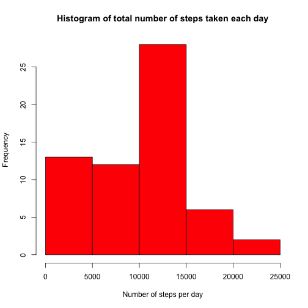
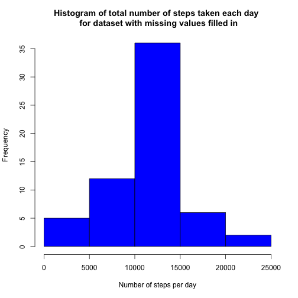

# Reproducible Research: Peer Assessment 1

### Loading and preprocessing the data

```r
# load activity dataset
activity <- read.table("activity.csv",header=T,sep=",")
# convert date column to Date data type
activity$date <- as.Date(activity$date,format="%Y-%m-%d")
```

### What is mean total number of steps taken per day?

#### Histogram of total number of steps taken per day


```r
library(plyr)
# calculate total steps per day
activity.per.day <- ddply(activity,.(date),function(df) sum(df$steps,na.rm=TRUE))
# rename columns
names(activity.per.day) <- c("date","total.steps")
# plot histogram
hist(activity.per.day$total.steps,  
     main="Histogram of total number of steps taken each day",  
     xlab="Number of steps per day",  
     col="red")
```

 

#### Mean and median total number of steps taken per day

```r
mean.steps <- mean(activity.per.day$total.steps)
median.steps <- median(activity.per.day$total.steps)
```
The **mean** number of steps taken per day is **9354.23**  
The **median** number of steps taken per day is **10395**  

### What is the average daily activity pattern?

#### Time series plot of the 5-minute interval and average number of steps across all days


```r
# calculate average number of steps per 5-minute interval
activity.per.interval <- ddply(activity,.(interval),function(df) mean(df$steps,na.rm=TRUE))
# rename columns
names(activity.per.interval) <- c("interval","avg.steps")
# plot time series
plot(x=activity.per.interval$interval,y=activity.per.interval$avg.steps,
     type="l",xlab="5-minute interval",ylab="Average number of steps",
     main="Time series plot of the 5-minute intervals \n and the average number of steps across all days")
```

 

#### Which 5-minute interval, on average across all the days in the dataset, contains the maximum number of steps?


```r
max.interval <- activity.per.interval[which.max(activity.per.interval$avg.steps),]
```
The 5-minute interval **835** contains the maximum average number of steps across all days: **206.17**

### Imputing missing values

#### Calculate and report the total number of missing values in the dataset

```r
num.missing.values <- sum(is.na(activity$steps))
```
There are **2304** missing values for the 'steps' field in the dataset

#### Strategy for filling in all missing values using the mean of the 5-minute interval

```r
# identify and subset observations with missing values
activity.missing <- activity[is.na(activity$steps),]
# identify and subset observations with no missing values
activity.complete <- activity[!is.na(activity$steps),]
# drop steps field in subset with missing values
activity.missing$steps<-NULL
# fill missing values with average steps for 5-minute interval
activity.missing <- merge(activity.missing,activity.per.interval,by="interval",all.x=TRUE,all.y=FALSE)
# rename columns
names(activity.missing)<-c("interval","date","steps")
# reorder columns
activity.missing <- activity.missing[,c(3,2,1)]
```

#### Create a new dataset that is equal to the original dataset but with the missing data filled in

```r
# convert steps column in complete subset to numeric data type
activity.complete$steps <- as.numeric(activity.complete$steps)
# row bind filled missing values subset with complete subset
activity.filled <- rbind(activity.missing,activity.complete)
# remove temp dataframes
rm(list=c("activity.missing","activity.complete"))
```

#### Histogram of total number of steps taken per day for dataset with missing values filled in


```r
# calculate total steps per day
activity.filled.per.day <- ddply(activity.filled,.(date),function(df) sum(df$steps))
# rename columns
names(activity.filled.per.day) <- c("date","total.steps")
# plot histogram
hist(activity.filled.per.day$total.steps,  
     main="Histogram of total number of steps taken each day \n for dataset with missing values filled in",  
     xlab="Number of steps per day",  
     col="blue")
```

 

#### Mean and median total number of steps taken per day for dataset with missing values filled in

```r
filled.mean.steps <- mean(activity.filled.per.day$total.steps)
filled.median.steps <- median(activity.filled.per.day$total.steps)
```
The **mean** number of steps taken per day is **1.0766 &times; 10<sup>4</sup>**  
The **median** number of steps taken per day is **1.0766 &times; 10<sup>4</sup>**  


#### Do these values differ from the estimates from the first part of the assignment? What is the impact of imputing missing data on the estimates of the total daily number of steps?

Yes, the values are different than the first estimates as reflected by the histogram above.  By filling in missing values with the 5-minute average across all days, there was an increase in the total number of steps taken per day.  Consequently, the histogram is more symetrical. 

### Are there differences in activity patterns between weekdays and weekends?

#### Create a new factor variable in the dataset with two levels – “weekday” and “weekend” indicating whether a given date is a weekday or weekend day.


```r
activity.filled$daytype <- ifelse(weekdays(activity.filled$date,abbreviate=TRUE)%in%c("Sat","Sun"),"weekend","weekday")
```


#### Panel plot for time series of the 5-minute interval and the average number of steps taken (averaged across all weekday or weekend days)


```r
int.avg.steps <- ddply(activity.filled,.(daytype,interval),function(df) mean(df$steps))
names(int.avg.steps)<-c("daytype","interval","avg.steps")
library(lattice)
xyplot(avg.steps~interval|daytype,data=int.avg.steps,layout=c(1,2),type="l",ylab="Number of steps",xlab="Interval")
```

 

The weekend displays higher averages during the 5-minute intervals between 1000 and 2000.  The individual for which the data was collected seems to be more active during the weekends.
